# 🛍 フリーマーケットアプリ

## ■ アプリ概要
ユーザー同士で商品を出品・購入できるフリマアプリです。
認証・商品管理・決済機能まで一通り実装しています。

---

## ■ 作成背景
実務で頻出する「ユーザー・商品・購入」の関係性を持つアプリを通して、
CRUD・認証・決済の理解を深めることを目的に作成しました。

---

## ■ 主な機能
- 会員登録 / ログイン（メール認証）
- 商品出品 / 編集 / 削除
- 商品一覧 / 詳細表示
- コメント機能
- いいね機能
- Stripe決済（テスト環境）
- マイページ

---

## ■ 技術スタック
- PHP 8.2
- Laravel 8
- MySQL 8
- Docker
- nginx
- Stripe

---

## ■ 画面イメージ

### 🏠 商品一覧
商品を閲覧、検索する画面。ログイン時はお気に入り商品をマイリストで閲覧可能。
- トップ画面（ログイン前）
- トップ画面（ユーザ_マイリスト）

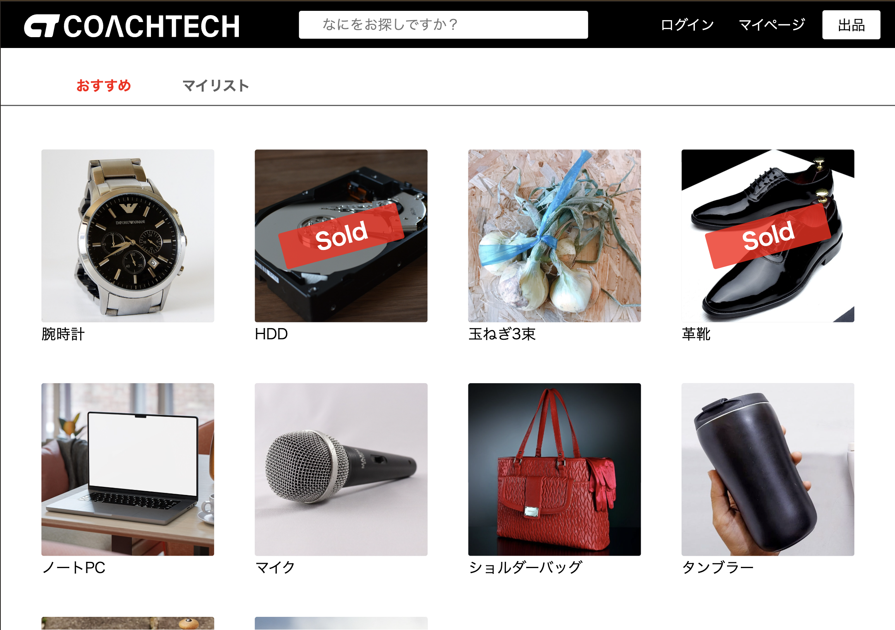
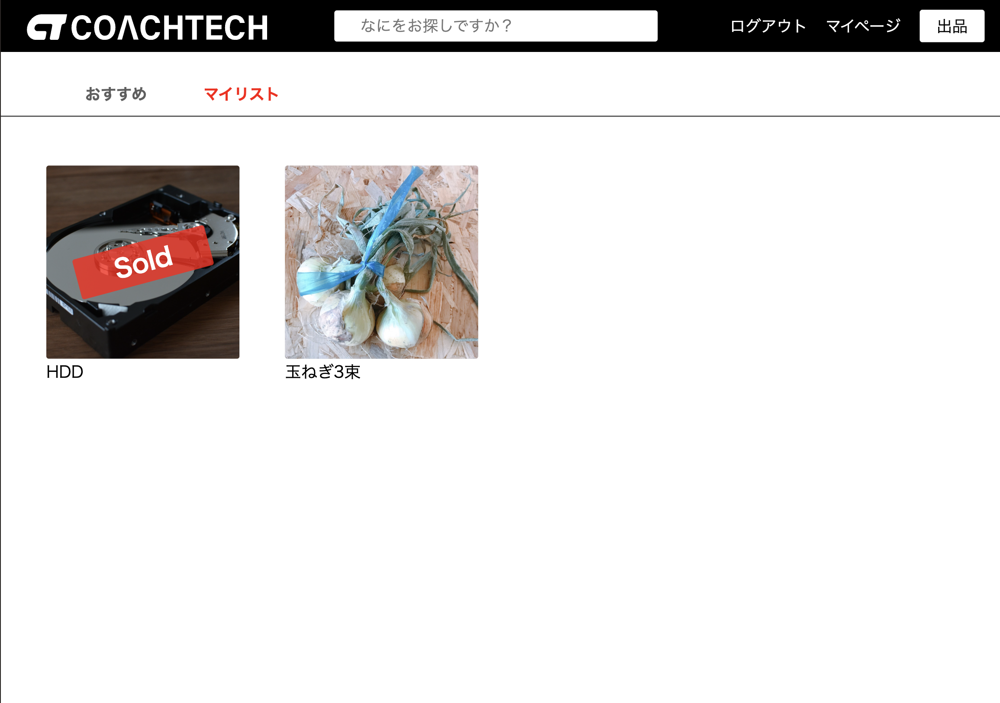

---

### 🔍 商品詳細・購入
商品詳細の閲覧画面。いいね機能、コメント機能あり。<br>
商品を購入する画面。支払い方法(コンビニ・カード)選択、住所変更機能あり。
- 商品詳細画面（商品情報・価格表示）
- 商品詳細画面（コメント）
- 商品購入画面
- 送付先住所変更画面

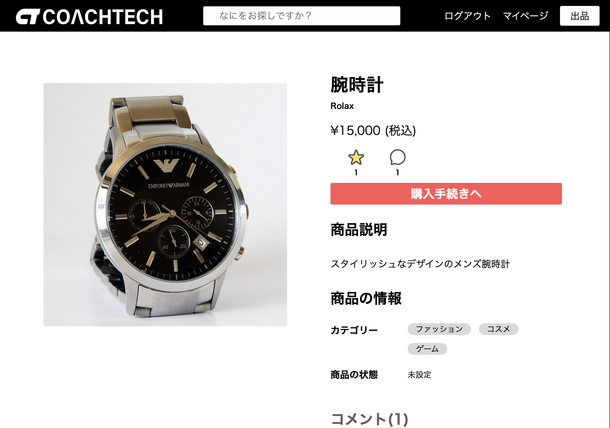
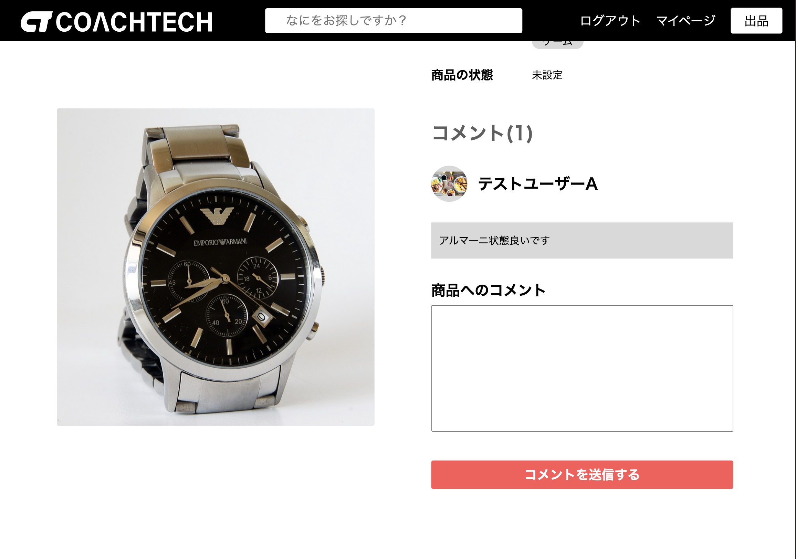
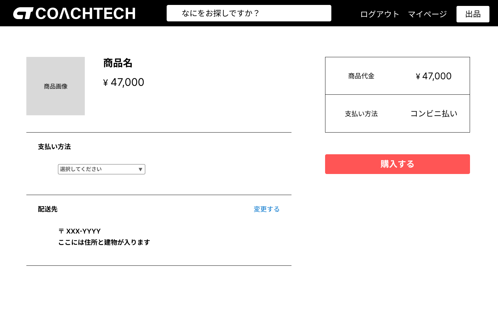
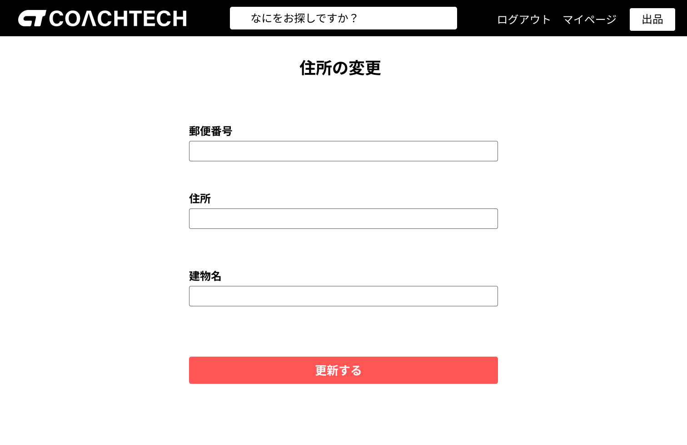

---

### 👤 ユーザー機能
会員登録(メール認証あり)、ログイン機能。<br>
初回登録時はメール認証後、プロフィール画面に遷移される。
- 会員登録
- ログイン
- メール認証誘導画面

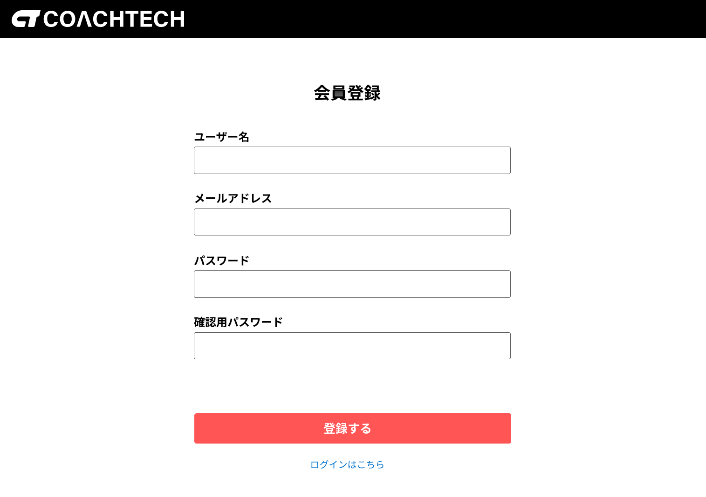
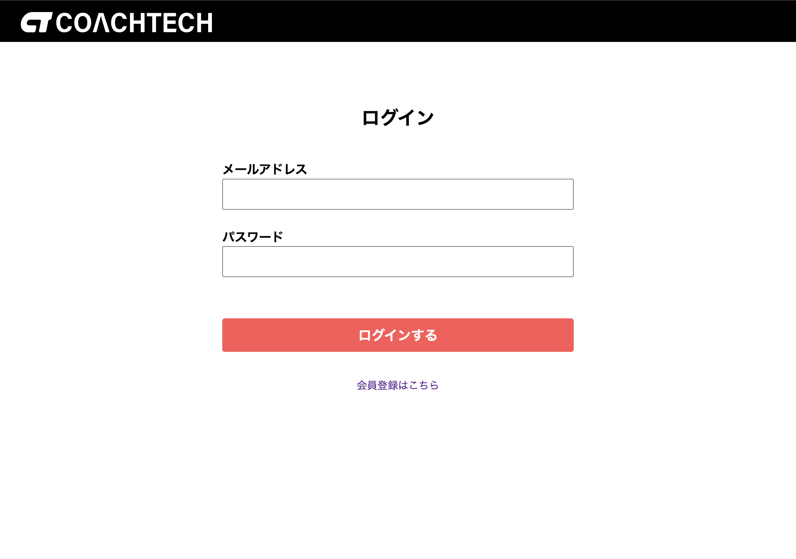
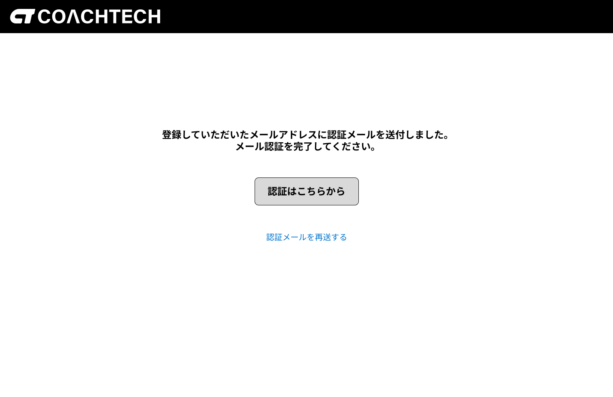

---

### 🛍 出品機能
商品の画像・カテゴリ(複数選択可)・状態・商品名・ブランド名・説明・価格を入力可能。
- 商品出品画面（商品画像・詳細）
- 商品出品画面（商品名・説明）

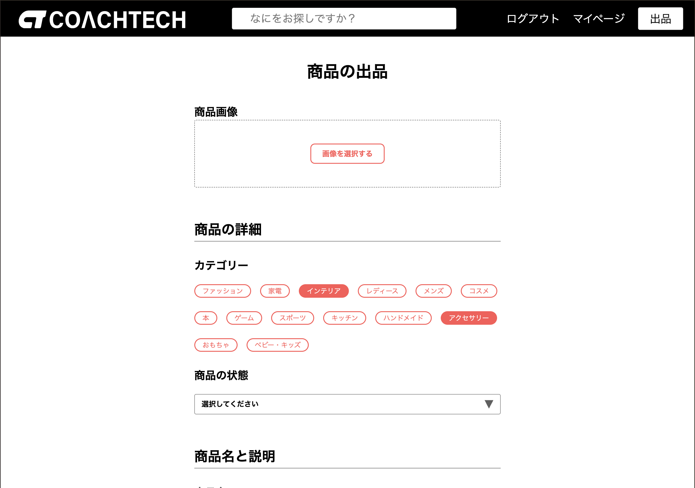
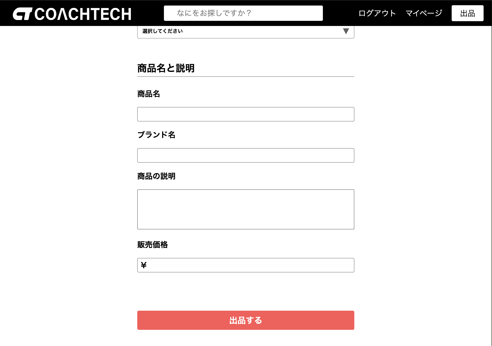

---

### 📄 マイページ
マイページでは出品商品と購入商品を閲覧可能。<br>
プロフィール(ユーザ名・郵便番号・住所)を編集可能。
- プロフィール画面
- プロフィール編集

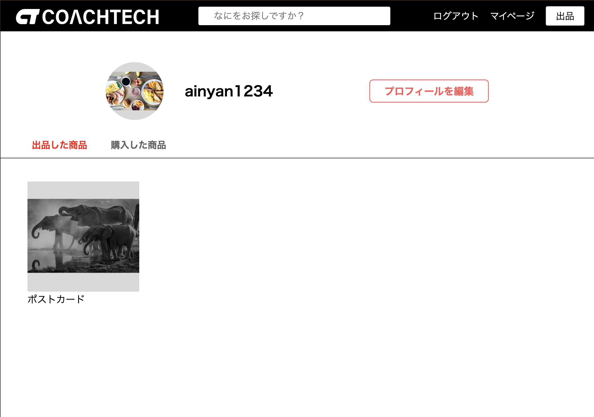
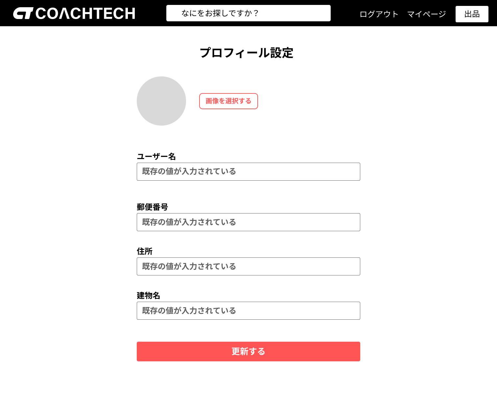

---

## ■ 技術的な工夫

### ① Fortifyをベースにした認証機構のカスタマイズ

Laravel Fortifyをそのまま利用するのではなく、
**内部の処理を理解した上で必要な部分のみ利用し、認証フローを独自に制御しました。**

#### ■ 実装内容
- ユーザー登録
  - Fortifyの`CreateNewUser`を利用しつつ、コントローラで処理を制御
- ログイン処理
  - Fortifyに依存せず、`Auth`を用いて独自実装
- メール認証制御
  - 未認証ユーザーはログイン後に強制ログアウトし、認証画面へリダイレクト
- ワンクリック認証機能
  - メール内リンクから即時認証できる仕組みを実装

#### ■ 工夫した点
- Fortifyのブラックボックス化を避け、処理の流れを明確にした
- 必要な機能のみを利用し、柔軟にカスタマイズ可能な構成にした
- UXを意識し、認証フローをシンプルに設計

---

### ② UIの再現性
提供されたFigmaデザインを元に、
**ピクセル単位での再現を意識して実装**しました。

- レイアウト崩れ防止
- コンポーネントの統一
- 実務を意識したマークアップ

---

### ③ Stripe決済の導入
テスト環境を利用して決済機能を実装

- APIキーを.envで管理
- 安全性を考慮した実装

---

### ④ テストの実装
Featureテストを作成し、主要機能の動作を確認
```
php artisan test
```

---

## ■ ER図


---

## ■ 今後の改善
- TailwindCSSによるUI改善
- 非同期通信（Ajax）の導入
- 決済フローの改善（購入完了画面の実装）

---

## ■ 環境構築
### Dockerビルド
1. git clone https://github.com/ainyan4645/flea-market_coachtech.git
2. cd flea-market_coachtech
3. docker-compose up -d --build

### Laravel環境構築
1. cd src
2. cp .env.example .env
3. cp .env.test_example .env.testing
4. docker-compose exec php bash
5. composer install
6. php artisan key:generate
7. php artisan key:generate --env=testing
8. php artisan migrate
9. php artisan db:seed
10. php artisan storage:link
11. Stripeアカウントを作成 [https://stripe.com/jp](https://stripe.com/jp)
12. stripeのテストモードで「開発者 > APIキー」を選択
13. 公開可能キーとシークレットキーをコピー
14. `.env`と`.env.testing`に、`STRIPE_KEY` / `STRIPE_SECRET`の項目を作って貼り付け
```
STRIPE_KEY=pk_test_xxxxxxxxxx
STRIPE_SECRET=sk_test_xxxxxxxxxx
```
15.  php artisan config:clear

 ※permissionエラーが出る場合は `/flea-market_coachtech` ディレクトリで適切な権限設定を行ってください。
 ```bash
 # コマンド例
 sudo chmod -R 777 src/*
 ```

## 使用技術(実行環境)
- php 8.2
- Laravel 8.0
- MySQL 8.0
- nginx 1.24

## ER図


## 開発環境(URL)
- 商品一覧画面(トップ)： http://localhost/
- phpMyAdmin： http://localhost:8080/
- Mailhog(メール確認)： http://localhost:8026

## 機能確認用ユーザ
- サンプル商品出品ユーザ<br>
メール： sell@example.com<br>
パスワード： password

- 認証必須機能確認用ユーザ<br>
メール： testA@example.com<br>
パスワード： password

## テストケース
以下のコマンドでテスト実行ができます。<br>
（テストファイル名はスプレッドシートからも参照できます。）

- 全てのテストを一括実行
```
php artisan test
```
- テストファイルごとにテスト実行
```
php artisan test --filter=テスト名
```
（例）
```
php artisan test --filter=RegisterTest
```

## 補足事項
- 画像アップロード時の画面に即時反映はJavaScriptを使用しないと難しいため、アップロード時は何も表示されません。フォーム送信後に画像が反映されているかのご確認をお願いいたします。
- stripe決済はまだ開発段階のため、現段階では「購入する」ボタン押下で先に購入完了し、決済画面に遷移する仕様です。(決済完了画面未作成)
- メール認証機能を実装済みです。「認証はこちらから」ボタンで自動認証され、Mailhog で確認可能です。
- 応用機能追加に伴い、テストケースの内容を多少変更しています。<br>
RegisterTest.phpの期待挙動: 全ての項目が入力されている場合、会員情報が登録され、"メール認証誘導画面"に遷移される