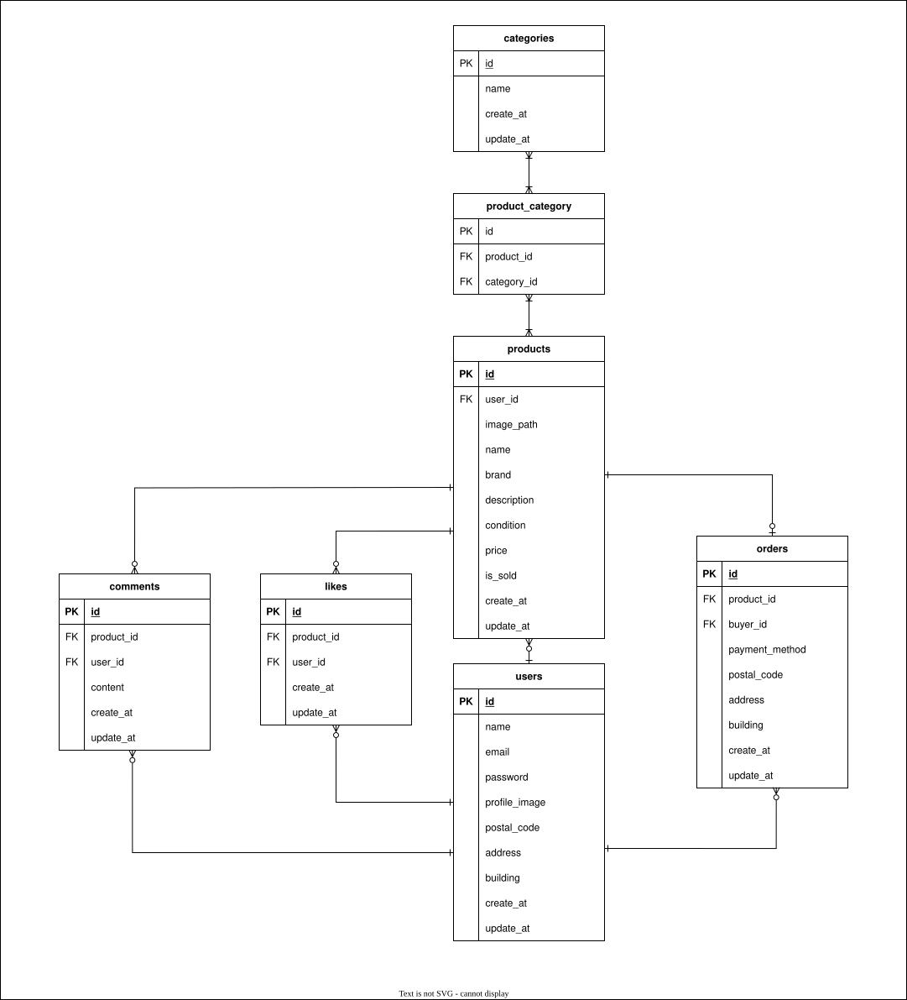

# フリーマーケットアプリ(模擬案件)

## 環境構築
### Dockerビルド
1. git clone https://github.com/ainyan4645/flea-market_coachtech.git
2. cd flea-market_coachtech
3. docker-compose up -d --build

### Laravel環境構築
1. cd src
2. cp .env.example .env
3. cp .env.test_example .env.testing
4. docker-compose exec php bash
5. composer install
6. php artisan key:generate
7. php artisan key:generate --env=testing
8. php artisan migrate
9. php artisan db:seed
10. php artisan storage:link
11. 公開可能キーとシークレットキーを`.env`と`.env.testing`の末尾に貼り付け

※公開可能キー、シークレットキーはセキュリティ上別途提示

12.  php artisan config:clear

 ※permissionエラーが出る場合は `/flea-market_coachtech` ディレクトリで以下のコマンドを実行してください。
 ```bash
 sudo chmod -R 777 src/*
 ```

## 使用技術(実行環境)
- php 8.2
- Laravel 8.0
- MySQL 8.0
- nginx 1.24

## ER図


## 開発環境(URL)
- 商品一覧画面(トップ)： http://localhost/
- phpMyAdmin： http://localhost:8080/
- Mailhog(メール確認)： http://localhost:8026

## 機能確認用ユーザ
- サンプル商品出品ユーザ<br>
メール： sell@example.com<br>
パスワード： password

- 認証必須機能確認用ユーザ<br>
メール： testA@example.com<br>
パスワード： password

## テストケース
以下のコマンドでテスト実行ができます。<br>
（テストファイル名はスプレッドシートからも参照できます。）

- 全てのテストを一括実行
```
php artisan test
```
- テストファイルごとにテスト実行
```
php artisan test --filter=テスト名
```
（例）
```
php artisan test --filter=RegisterTest
```

## 補足事項
- 画像アップロード時の画面に即時反映はJavaScriptを使用しないと難しいため、アップロード時は何も表示されません。フォーム送信後に画像が反映されているかのご確認をお願いいたします。
- stripe決済はまだ開発段階のため、現段階では「購入する」ボタン押下で先に購入完了し、決済画面に遷移する仕様です。(決済完了画面未作成)
- メール認証機能を実装済みです。「認証はこちらから」ボタンで自動認証され、Mailhog で確認可能です。
- 応用機能追加に伴い、テストケースの内容を多少変更しています。<br>
RegisterTest.php: 全ての項目が入力されている場合、会員情報が登録され、メール認証誘導画面に遷移される
